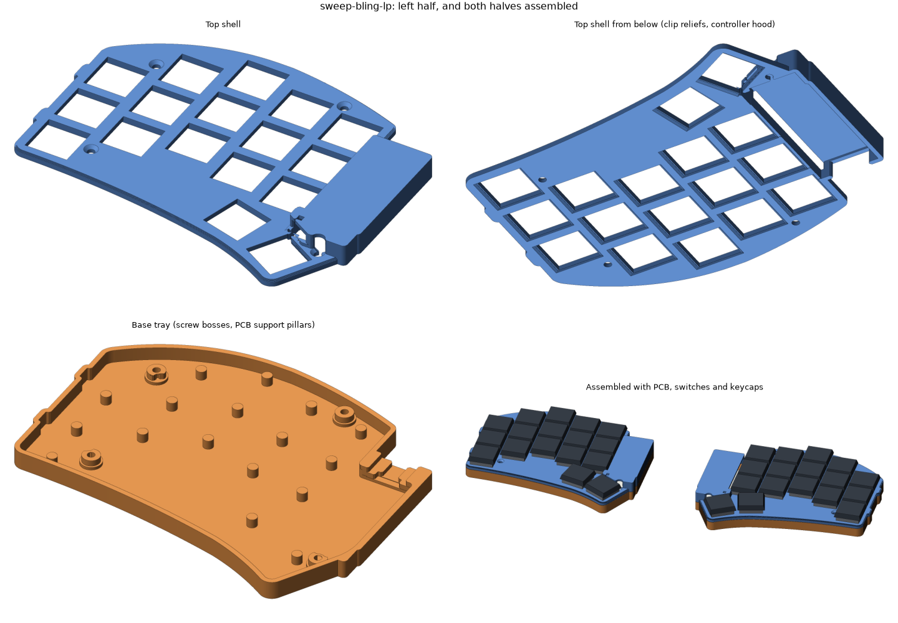
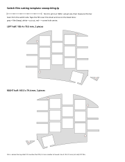

# Enclosed case: Ferris Sweep Bling LP (wireless)

A two-piece case per half, in the style of the PandaKB Forager:

- **Top shell**: a 2.2 mm switch plate that sits flat on the PCB. It covers the whole board
  except the switches, and the Choc switch clips snap under it, so switches can't work loose.
  A raised hood covers the nice!nano and battery and leaves openings for USB-C, the power
  switch and the reset button.
- **Base tray**: floor and side walls, 4 screw bosses with hex-nut pockets underneath, and a
  support pillar under every key.
- 4 M2 screws per half go down through the top shell, the PCB's mounting holes and the base,
  clamping the PCB between them.

You don't need a 3D printer. The parts are set up to be ordered in resin from JLCPCB's
3D-printing service (JLC3DP), the same way you'd order keycaps. See
[Ordering from JLCPCB](#ordering-from-jlcpcb).



The geometry comes from the board's open-source KiCad file, so the case matches the real switch,
screw-hole and outline positions. Component heights come from keebmaker's 3D model of this build
and from photos of your current board.

## What to buy

**Keyboard: your current one.** The case is built around it: it's keebmaker's Sweep Bling LP
build, the same PCB and parts the case was designed from. So you can order the case first and
move your current board into it. Only buy a new board if its dead key can't be fixed (see
[Before ordering](#before-ordering)).

**If you do need a new board:** keebmaker's [Sweep Bling LP Prebuilt](https://keebmaker.com/products/ferris-sweep),
**Wireless** option (US$219 when checked). It's the same PCB and build, so it fits the same case.
It's the only fully pre-soldered wireless Sweep I found that uses the public PCB design
([davidphilipbarr/Sweep](https://github.com/davidphilipbarr/Sweep), "Sweep Bling LP").
Alternatives I ruled out:

| Option | Why not |
|---|---|
| beekeeb pre-soldered Sweep Choc hotswap | wired only (RP2040) |
| beekeeb Wireless Sweep Bling LP | DIY kit: you solder it yourself |
| mechboards / holykeebs Sweep | wired only; mechboards uses its own MX-spaced PCB |
| splitkb Halcyon Ferris | different PCB, proprietary controller |

Put these in the order notes:

1. Build it like your current one: nice!nano v2 **face-down on low-profile headers** with the LiPo
   **under the nano**. The hood is sized for that: up to 5.6 mm above the PCB.
2. Keep the battery leads short. The case has a 5 mm bay past the USB end for the lead loop.
3. A TRRS jack isn't needed for wireless. The hood covers one if they fit it anyway.
4. If they offer a bottom tray or plate, you don't need it. This case replaces it.

**Hardware (both halves).** JLC only offers threaded inserts from M3 up, so the base holds
plain M2 nuts instead. Any hardware store, McMaster-Carr, or an M2 assortment kit with 8 mm
countersunk screws will do. Get a few spares of each. The Amazon links below matched these
specs and were in stock on 2026-10-08.

- 8 × M2×8 countersunk screws (ISO 10642 / DIN 7991, 90° flat head). Must be **8 mm** overall:
  6 mm is too short to reach the nut, and 10 mm sticks out of the bottom. For example
  [iexcell M2×8, 100-pack](https://www.amazon.com/dp/B0GYKDNQW7) ($8, comes with the hex key),
  or [black, 50-pack](https://www.amazon.com/dp/B0H5JSLK5S) ($6, also with a key) to match a black case.
- 8 × plain M2 hex nuts (DIN 934: 4 mm across flats, 1.6 mm thick). Not nylon-insert lock nuts:
  they're too thick for the pockets. For example [uxcell M2, 100-pack](https://www.amazon.com/dp/B07H3SXSN2) ($8).
- A 1.3 mm hex key for those screws (or a small Phillips driver for Phillips flat heads).
- A small flat needle file and a hobby knife, to clean up support marks. For example a
  [6-piece mini file set](https://www.amazon.com/dp/B07KH8BG1F) ($5), and the X-ACTO knife from
  the [switch film](#shopping-list) list.
- Optional: small self-adhesive rubber bumpers for the bottom, for example
  [3/8 in clear bumpers](https://www.amazon.com/dp/B0CKLX6KQQ) ($6).
- Optional: supplies for a Toucan 2-style [switch film](#switch-film-optional).

## Files (`stl/`)

| File | Upload? | What it is |
|---|---|---|
| `sweep-bling-lp_left_top.stl`, `sweep-bling-lp_right_top.stl` | yes | Top shells: 113 × 91 × 7.2 mm, 9.5 cm³ each |
| `sweep-bling-lp_left_base.stl`, `sweep-bling-lp_right_base.stl` | yes | Base trays: 113 × 91 × 6.0 mm, 16.2 cm³ each |
| `switch_fit_coupon.stl` | yes | Switch-hole sample: 13.9 / 14.0 / 14.1 mm holes (1 / 2 / 3 dots). The case uses 14.0 (2 dots). 60 × 22 × 2.2 mm |
| `sweep-bling-lp_{left,right}_template_1to1.svg` | no | Full-size paper template for checking the PCB |
| `sweep-bling-lp_film_template_1to1.svg` | no | Full-size cutting template for the [switch film](#switch-film-optional), both halves |
| `sweep-bling-lp_film_cut.svg`, `sweep-bling-lp_film_cut.dxf` | no | The switch film's outlines only, for a cutting machine (mm) |
| `sweep-bling-lp_preview.png` | no | 3D renders |
| `sweep-bling-lp_{left,right}_sections.png` | no | Horizontal cross-sections with the PCB and parts overlaid |
| `sweep-bling-lp_report.json` | no | Automated check results |

## Before ordering

The case is made for your current board, so check that board before you order:

1. **Take it out of keebmaker's tray.** Pull the keycaps and switches if they're in the way,
   then undo the tray's screws. You need it apart anyway to work on the dead key.
2. **Check it against the paper template.** Print each template SVG on an ordinary printer at
   100% ("actual size", not "fit to page"). The scale bar must measure 50 mm. Lay each half on
   its template, switch side up: the PCB edge and the 4 screw holes should line up. If they
   don't, stop: the case won't fit.
3. **Check the controller.** The nice!nano and battery must stand no more than 5.6 mm above the
   PCB, with the battery under the nano (not in the old tray), and the battery leads tucked in
   at the nano's USB end, where the hood has a 5 mm bay.

Then order the case and the hardware. With express shipping it takes about 1–1.5 weeks. While
you wait:

- Work on the dead key while the board is apart: see
  [KEYBOARD-MOISTURE-PLAN.md](../../KEYBOARD-MOISTURE-PLAN.md#sweep-and-totemist-inspect-connections-before-replacing-more-switches).
  Clean off any sweat residue before the board goes into the new case.
- Put it back in its tray if you want to keep typing on it in the meantime.
- Cut the [switch film](#switch-film-optional) if you want one.

When the case arrives, move the board into it ([Assembly](#assembly)). If the key is still dead,
order the new board then. When it arrives, check its controller the same way (step 3).

## Ordering from JLCPCB

1. Go to [jlc3dp.com](https://jlc3dp.com) (or **3D Printing** on jlcpcb.com) and start an
   instant quote with your JLCPCB account.
2. Upload the 5 files marked "yes" above. Units are millimetres: each part should show the size
   in the table. If a part shows up 25 times too small or too big, the units are wrong.
3. Pick **SLA (resin)**, material **JLC Black Resin**, quantity **1** of each file. Left and
   right are different parts, not copies.
4. Leave the surface finish at the default. Skip paint and coatings: they add 0.1–0.2 mm and
   would tighten the switch holes.
5. Paste this into the order's remark field:

   ```text
   Mechanical keyboard case: 4 parts + 1 test coupon. The parts screw together, so accuracy matters.
   - *_top files: please keep supports and support marks off the flat top face (keycap side) and
     the outer side walls. Supports on the underside are fine.
   - *_base files: supports on the outside bottom are fine. Please keep them off the inside
     (the pillar and boss tops hold the PCB).
   - The 14 mm square holes, the small ledges under them and the hex pockets are functional.
     Please don't fill, repair or scale the models.
   If a part can't be printed this way, please contact me before printing. Thank you!
   ```

6. Pick an express shipping option for speed. If checkout asks for a customs description,
   "keyboard case parts (plastic)", HS code 8473.30, fits.
7. JLC reviews the files by hand. If they email about thin walls or small holes, you can tell
   them to go ahead. Nothing is thinner than 0.8 mm, and the smallest holes are deliberate: the
   1.8 mm reset-button hole, the 2.4 mm screw holes and the 1.2 mm marker dots on the coupon.

**Cost and time** (checked 2026-10-07; JLC's quote is the real number):

- The 5 parts are about 53 cm³ of resin. JLC Black Resin starts at about US$1 per part. Expect
  roughly US$20–50 for the set, plus shipping.
- For US delivery, JLC has collected estimated import duties at checkout since March 2026, so
  checkout costs more than the parts alone.
- Production takes 2–3 days. With express shipping, expect the parts in about 1–1.5 weeks.
- If you order PCBs from JLCPCB anyway, the parts can ship with them.

## Why resin, and why these sizes

**Material.** Resin (SLA) suits this case best because it's smooth and accurate:

| Material (JLC name) | Good | Bad |
|---|---|---|
| **JLC Black Resin** (recommended) | Smooth, true black (hides grime and support marks), ±0.2 mm accuracy, takes heat up to ~55–65 °C, cheap | Brittle: cracks if you overtighten a screw or drop it on a corner |
| Imagine Black resin | JLC lists it for humid conditions | Softens at ~46 °C, so not in a hot car; from about US$2 per part |
| Black Resin | Cheapest | Slightly greyish |
| 9600 / LEDO 6060 resin | Smooth and accurate too | White, so it shows grime |
| MJF PA12 / PA11 nylon | Much tougher: hard to crack | Grainy, slightly porous surface that soaks up sweat and skin oil; ±0.3 mm accuracy; JLC says snap and press fits are less reliable |

Cured resin isn't porous and wipes clean, so sweat on the case itself is fine. The case's job
is to keep sweat off the PCB, and that comes from its shape.

**Fit, without a printer to test on.** At home you'd print a test piece and adjust. With an
order, each retry costs money and 1–2 weeks. So the design errs on the loose side wherever loose
is harmless:

- **Switch holes are 14.0 mm** for a 13.8 mm switch body. Even at the tight end of resin's
  ±0.2 mm tolerance, that's still the standard 13.8 mm Choc plate cutout. A slightly loose hole
  doesn't matter: the PCB's pegs and hotswap sockets locate each switch, and the clips still
  catch under a 0.3 mm ledge on each side.
- **Clearances:** 0.4 mm between the PCB edge and the walls, 2.4 mm screw holes for M2 screws,
  4.3 mm pockets for 4.0 mm nuts, and at least 0.25 mm around switches, keycaps and the
  controller.
- **No thin walls:** nothing is thinner than 0.8 mm, JLC's minimum for resin. The generator
  trims away any thinner slivers. The plate, walls, floor and hood are 1.2–2.2 mm thick.
- **The coupon** comes in the same order for about a dollar. If the switch holes come out too
  tight or too loose, it shows which size to use if you ever reorder. A tight hole is usually
  fixed with a few strokes of a file anyway.

## When the parts arrive

1. **Clean off support marks.** Check the nut pockets, the pillar and boss tops, the screw holes
   and the ledges under the switch holes. Scrape nubs off with a hobby knife or file. If you
   sand, sand wet: resin dust irritates.
2. **Test a switch in the coupon's 2-dot hole**, which matches the case. It should click in,
   stay put when you turn the coupon over, and still come out with a switch puller.
   - Too tight: file the case's switch holes lightly with the needle file and try again. Don't
     force switches in: the plate can crack.
   - A bit loose: fine, as long as the clips still catch.
3. **Test-fit the PCB** in the base tray. It should drop in with a little play all round.

## Switch film (optional)

The Toucan 2 has a thin black foam sheet on its PCB, under the plate, with a square hole for
each switch. You can add the same layer to this case: a sheet of clear PET film, 0.10–0.13 mm
(4–5 mil) thick, between the PCB and the top shell. Cut it by hand from a printed template
(about an hour the first time), or with a cutting machine.



- **What it's for:** a second sweat barrier. Anything that creeps in under the plate lands on
  waterproof plastic instead of the PCB. Like the Toucan's sheet, it leaves the PCB under each
  switch uncovered, so it's a splash guard, not waterproofing.
- **It matches the STLs exactly.** The generator slices the top-shell model where it sits on
  the PCB and shrinks that shape by 0.3 mm on every edge. So the film stays out of the switch
  holes, the ledges the switch clips catch on, the screw holes and the hood, and it ends 0.3 mm
  inside the PCB edge. Strips narrower than 1.5 mm are left out because they'd tear.
- **Each half is 2 pieces:** the main sheet, and a small triangle at the screw next to the
  thumb keys. Don't skip the triangle: without it, that screw bends the corner of the top shell
  down by the film's thickness.
- **The case doesn't change.** The film lifts the top shell by its thickness. With 5 mil film,
  the switches sit 0.13 mm higher, the seam between the top shell and the base opens from 0.2
  to 0.33 mm, and the screws reach 0.13 mm less far into the nuts, which still leaves about 3
  threads. Don't use anything thicker than 7 mil (0.18 mm).
- **PET film only.** The Toucan's foam is there for sound. Against a PCB, foam soaks up sweat
  and holds it there, and so do felt and paper (see
  [KEYBOARD-MOISTURE-PLAN.md](../../KEYBOARD-MOISTURE-PLAN.md)). Skip self-adhesive sheets too:
  they glue themselves to the PCB.

### Get the shape

It's already made. The generator writes it next to the STLs, from the same model:

- `stl/sweep-bling-lp_film_template_1to1.svg`: both halves at full size, seen from the switch
  side, with a 50 mm scale bar. Print it and cut along its lines.
- `stl/sweep-bling-lp_film_cut.svg` and `.dxf`: the same outlines only, for a cutting machine.
  Left half on top, right half below, 105.5 × 168.9 mm in total.

If you change the case and regenerate (see [Regenerating or tweaking](#regenerating-or-tweaking)),
these files are remade to match the new STLs. Every run checks that the film keeps 0.3 mm from
every top-shell opening and the PCB edge, and prints `film ... -> OK`. Always cut from the files
that came with the STLs you ordered.

### Shopping list

Prices are what Amazon showed on 2026-10-08. None of these had a Prime Day deal then.

| What | Amazon | Price | Notes |
|---|---|---|---|
| Clear PET film, 0.005 in (5 mil), 9 × 12 in | [Grafix Dura-Lar Clear .005" pad](https://www.amazon.com/dp/B002542SZY) | $17 | The film. One sheet makes both halves; the rest are spares. It's polyester (Mylar), not acetate |
| Hobby knife | [X-ACTO #1, with 5 #11 blades](https://www.amazon.com/dp/B0000DD1N4) | $9 | Also the knife for cleaning off support marks |
| Spare blades | [X-ACTO #11, 15-pack](https://www.amazon.com/dp/B00004Z2U0) | $9 | A sharp blade matters more than anything else here |
| Self-healing cutting mat | [OLFA 12 × 18 in](https://www.amazon.com/dp/B0CNV35WVP) | $22 | Any mat at least 9 × 12 in works |
| Metal ruler with a cork back | [Mr. Pen 6 + 12 in, 2-pack](https://www.amazon.com/dp/B0GXKKHC12) | $5 | The cork stops it sliding on the film |
| Painter's tape | [ScotchBlue 1 in, 6 rolls](https://www.amazon.com/dp/B006ARJVZM) | $18 | Any masking tape you already have works |
| Optional: hollow punch set | [TLKKUE 1–10 mm](https://www.amazon.com/dp/B0CGHN2RMX) | $15 | The 3 mm punch makes clean screw holes. Without it, cut small squares |
| Optional: cutting machine | [Cricut Joy Xtra](https://www.amazon.com/dp/B0DCWDJ2GX) + [8.5 × 12 in mats](https://www.amazon.com/dp/B0DXXC8JJ9) | $149 + $12 | Replaces the knife, ruler and punch. Only worth it if you'll use it for other things too. It doesn't come with a mat |

Don't search Amazon for "switch film": that finds MX switch films, small shims that go inside
each switch. They're a different thing.

### Cut it by hand

1. **Print the template** like the PCB template: at 100% ("actual size", not "fit to page") on
   Letter or A4 paper. The scale bar must measure 50 mm.
2. **Tape it down.** Tape the template to the cutting mat. Lay a sheet of film over it and tape
   the film's corners with painter's tape. One 9 × 12 in sheet covers both halves.
3. **Cut the switch holes first and the outline last,** so the film stays taped down and stiff
   while you do the small parts. For each straight line:
   - Lay the ruler on the grey side (the part you keep), so a slip goes into the waste.
   - Hold the knife upright and make 2–3 light strokes rather than one hard one.
   - Start and stop exactly at the corners: an overcut can turn into a tear.
   - If a cut-out doesn't lift out freely, cut that line again. Don't tear it out.
4. **Screw holes:** centre the 3 mm (or 1/8 in) punch on each red cross and give it one firm tap
   with a hammer, with a scrap of wood under the film. Or cut a 3 mm square around the cross
   with the knife. A hole slightly bigger than the circle is fine; a smaller one isn't.
5. **Cut the outline,** including the narrow fingers along both sides and the small triangle.
   Cut the curves in short knife strokes, or with scissors. Change the blade as soon as it
   drags: a dull blade wanders.
6. **Check it on the PCB** before assembling. Lay it on the PCB, switch side up. The film must
   not cover any of the holes at a switch position, the screw holes must be clear, nothing may
   lie on the controller, and the film must end inside the PCB edge all round. Trim anything
   that's in the way. If nothing lines up, the film is upside down or on the wrong half: flip
   or swap it.
7. Wipe off fingerprints with a dry cloth, and keep each half's 2 pieces together for
   [assembly](#assembly) (step 4).

### Or with a cutting machine

- **Cricut:** in Design Space, start a new project, click **Upload** → **Upload Image**, pick
  `stl/sweep-bling-lp_film_cut.svg` and add it to the canvas. Check the size: 105.5 × 168.9 mm
  (4.15 × 6.65 in). If it's different, set the width to 4.15 in with the size lock closed.
  Click **Make It** and leave **Mirror** off. Trim a film sheet to fit the mat and press it flat
  onto a StandardGrip mat. Design Space has no setting for plain PET film: search the material
  list for "transparency" or "stencil film" and set the pressure to **More**. Before you unload
  the mat, lift the corner of a cut-out with the knife tip. If it isn't cut through, unload and
  finish those lines with the knife, and pick a thicker material setting next time.
- **Silhouette, laser cutter or makerspace:** use `stl/sweep-bling-lp_film_cut.dxf` (mm).
  Silhouette Studio's free edition opens DXF files but not SVG.

Then check the pieces on the PCB as in step 6 above.

## Assembly

1. Pull all keycaps and switches (hotswap). If the board is still in keebmaker's tray, take it
   out.
2. Put an M2 nut into each hex pocket on the underside of the base. If one is snug, pull it in:
   put a screw through the boss from inside the tray, thread it into the nut and tighten gently
   until the nut seats, then take the screw out. A bit of tape holds loose nuts in place.
3. Set the PCB into the base, hotswap sockets down. It rests on the 4 bosses and the pillars.
4. Optional: lay the [switch film](#switch-film-optional) on the PCB, with its holes over the
   screw holes and every switch footprint uncovered. Put the small triangle at the screw next
   to the thumb keys.
5. Put the top shell on and line up the 4 holes. If you added the film, lower the shell straight
   down so the film doesn't slide, then look through the switch holes: no film should show.
   Drive the M2×8 screws in from the top until the heads sit flush and the PCB can't move, then
   **stop**. Resin cracks if you crank it, so use fingertip force only.
6. Push each switch through the plate into its socket until it clicks, then refit the keycaps.
7. To use:
   - **Power switch:** reach it through the USB-C opening with a toothpick. Its lever sits
     just below the port.
   - **Reset/bootloader:** press the button with a paper clip through the small hole in the
     hood roof.
8. Optional: stick rubber bumpers on the bottom so it doesn't slide.

To clean it, wipe it with a damp cloth (no acetone or other strong solvents). Keep it out of hot
cars and direct summer sun.

## Regenerating or tweaking

```sh
python3 -m venv .venv
.venv/bin/pip install manifold3d shapely trimesh numpy matplotlib
.venv/bin/python generate_case.py            # ~20 s, writes stl/
.venv/bin/python generate_case.py --help     # --no-preview, --out DIR, --sides left
```

All dimensions are in the `P` dict at the top of `generate_case.py` (mm). After a change,
regenerate and upload the new STLs. The useful ones:

| Parameter | Default | Effect |
|---|---|---|
| `cut` | 14.0 | Switch hole size. For a reorder, use the coupon hole that fit best: 1 dot = 13.9, 3 dots = 14.1 |
| `gap` / `wall` | 0.4 / 1.6 | PCB-to-wall clearance / wall thickness |
| `cav` / `floor` | 3.0 / 1.6 | Air gap under the PCB / floor thickness |
| `hood_clear`, `hood_wall`, `hood_roof` | 0.4, 1.4, 1.2 | Controller hood |
| `min_feature` | 0.8 | Anything thinner is trimmed away (JLC's minimum wall for resin) |
| `feet_d` | 0 | Set to e.g. 8.2 to add recesses for 8 mm bumpers |
| `film_clear` / `film_min` | 0.3 / 1.5 | Switch film: gap to every top-shell opening and the PCB edge / narrower strips are left out |

The `sweep-bling-lp` entry in `PROFILES` lists the parts the case works around: controller,
battery-lead bay, USB-C, TRRS, reset, power switch. Every run checks that each part is one
watertight solid. It also checks that no part of the case overlaps the PCB, switches, pressed
keycaps, hotswap sockets or the controller. Results are printed and saved to the report. Don't
upload anything marked `CHECK`. Another board needs its KiCad file and a new profile.

If you ever print it yourself on a filament (FDM) printer instead: use PETG, no supports, top
shells plate-side down, and try `cut` = 13.9.

## Assumptions and limits

- **Built around your current board's build.** A new board must be built the same way. If one
  arrives with tall socket headers, the battery somewhere else, or long battery leads, measure
  the nano + battery stack before assembling. It must be ≤ 5.6 mm above the PCB, or raise the
  hood in the profile and reorder the top shells.
- **Keycaps:** assumes MBK-size Choc caps (17.5 × 16.5 mm). Pressed keycaps clear the case by
  ≥ 0.3 mm vertically and 0.6 mm sideways.
- **One unavoidable slit:** the nice!nano sits only 0.46 mm from the inner-column keycaps, so
  the hood can't have a full wall there. There's a ~0.6 mm gap along that edge above 3.3 mm.
- **Sweat:** the plate covers the PCB everywhere except under the switch housings, and the
  controller is under the hood. This is a splash guard, not waterproofing: see
  [KEYBOARD-MOISTURE-PLAN.md](../../KEYBOARD-MOISTURE-PLAN.md).
- **Dimensions:** the case is 1.6 mm thicker underneath than keebmaker's tray. It's 8.4 mm from
  the desk to the plate top, and 13.4 mm to the top of the hood.
- **License:** `pcb/sweepbling-lp.kicad_pcb` is from davidphilipbarr/Sweep (Solderpad Hardware
  License v2.1).
